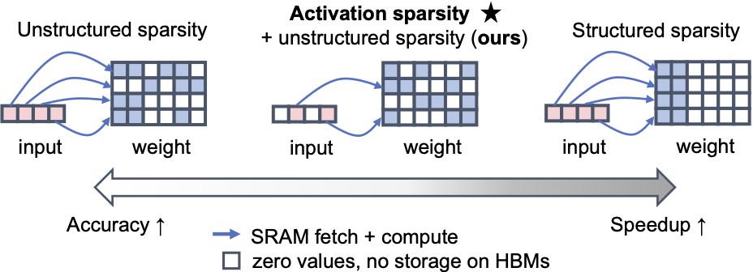

# DuoGPT

We propose DuoGPT, a training-free pruning framework that integrates activation sparsity into OBC framework to enable efficient dual-sparse LLM inference with state-of-the-art accuracy–efficiency trade-offs and scalability.

<h1 align="center">   
      
</h1>  

Code implementation of DuoGPT (NeurIPS 2025)

Paper link: https://arxiv.org/abs/2506.20194

### News
- [09/2025] DuoGPT is accepted to NeurIPS 2025.

### Abstract
Large language models (LLMs) deliver strong performance but are difficult to deploy due to high memory and compute costs. While pruning reduces these demands, most methods ignore activation sparsity observed at runtime. We reinterpret activation sparsity as dynamic structured weight sparsity and propose **DuoGPT**, a unified framework that constructs dual-sparse (spMspV) workloads by combining unstructured weight pruning with activation sparsity. To preserve accuracy, we extend the Optimal Brain Compression (OBC) framework with activation-aware calibration and introduce output residuals from the dense model as correction terms. We further optimize the solution for efficient GPU execution, enabling scalability to billion-parameter LLMs. Evaluations on LLaMA-2 and LLaMA-3 show that **DuoGPT** outperforms state-of-the-art structured pruning methods by up to 9.17\% accuracy at an iso-speedup of 1.39x compared to the baseline dense model.

### Source Code
For the most updated version of code, please refer to this repository: https://github.com/RuokaiYin/DuoGPT


### Contact and Citations
Ruokai Yin (ruokai.yin@yale.edu)

If you find our work useful, please consider giving a star and citation:

```bibtex 
@article{yin2025duogpt,
  title={DuoGPT: Training-free Dual Sparsity through Activation-aware Pruning in LLMs},
  author={Yin, Ruokai and Li, Yuhang and Lee, Donghyun and Panda, Priyadarshini},
  year={2025},
  journal={arXiv preprint arXiv:2506.20194}
}
```
